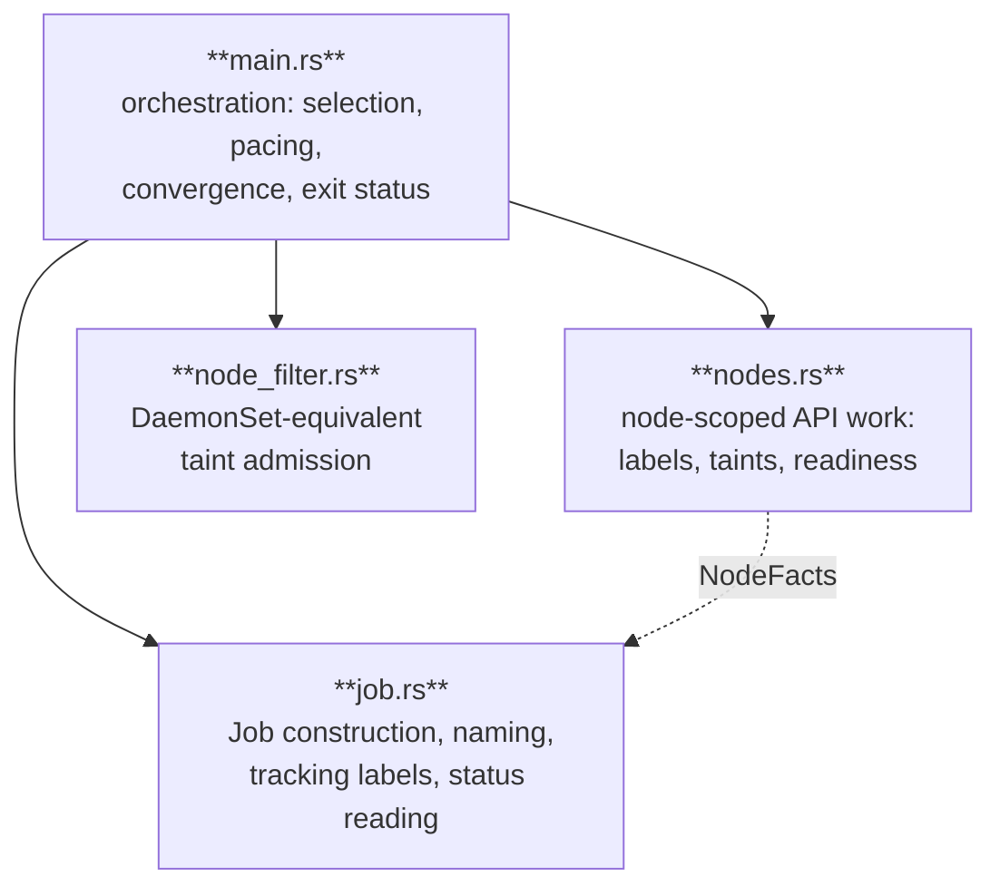
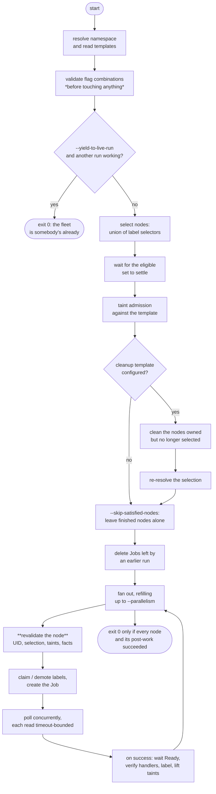
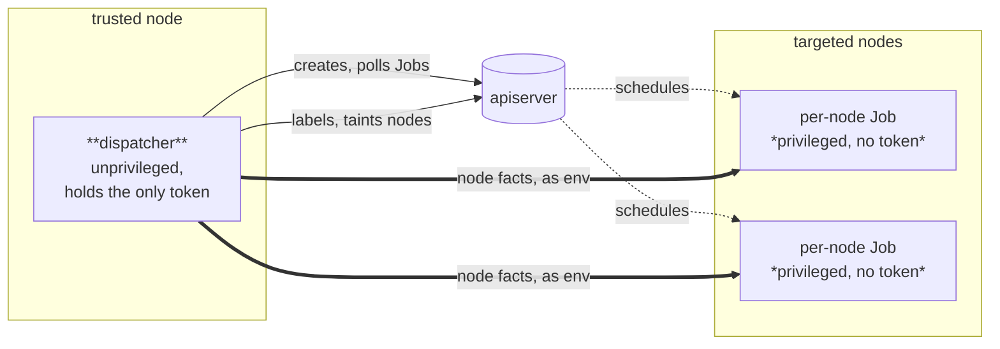

# One Job Per Node, Paced and Terminating

**Design notes for a dispatcher that gives per-node coverage, a bounded
blast radius, and a single exit code to gate a rollout on**

## Introduction and Motivation

Some work has to happen exactly once on every node of a cluster, and Kubernetes
has no primitive for it. Installing a runtime, replacing a kernel module,
draining a cache, migrating an on-disk layout: each is a privileged operation
that mutates the host, and each is the kind of thing an operator wants to run
deliberately, watch finish, and gate the next step on.

The two obvious primitives each solve half of it. A **DaemonSet** reaches every
node but never finishes, because it is level-triggered by design: there is no
moment at which it reports that all nodes are done and no exit code to branch
on, and its rollout is difficult to pace precisely. An **Indexed Job** with
`completions` set to the node count and a topology spread constraint paces
nicely but silently loses coverage, because once `parallelism < completions` the
scheduler stops balancing the spread — it ignores already-completed pods when
computing skew, so some nodes receive two Jobs and others none.

This dispatcher provides all three properties at once, and the rest of this
document is about what that costs. The short version: bypassing the scheduler to
guarantee placement means re-implementing the parts of the scheduler and the
DaemonSet controller that would otherwise have protected you, and doing
privileged work on many hosts at once means being far more careful than usual
about *which* host you are actually talking to.

### The three properties

| Property | DaemonSet | Indexed Job + spread | This dispatcher |
| --- | --- | --- | --- |
| Every node covered exactly once | yes | no, once paced | yes |
| Bounded number running at a time | awkward | yes | yes |
| Terminates with a single result | no | yes | yes |

The last row is what makes it usable as a Helm hook, a CI gate, or a step in an
upgrade pipeline: the process exits non-zero and names the nodes that failed.

## Structure

Four modules, split by the kind of reasoning each one does rather than by the
API objects they touch.



`main.rs` is the only module that decides anything about *ordering*. `job.rs` is
pure: given a template and a node it produces a Job object, and given a Job it
reports an outcome. `node_filter.rs` is pure as well, and answers exactly one
question: would a DaemonSet's pod have been admitted to this node? `nodes.rs`
holds every write to a Node object, which is where the concurrency hazards live.

The separation is load-bearing for testing. Selection, admission, naming,
sanitization, ownership arithmetic and status interpretation are all decidable
without a cluster, and the test suite exercises them directly.

## Lifecycle of a Run



### Resolution and validation

The namespace comes from `--namespace`, then `$POD_NAMESPACE`, then the
ServiceAccount namespace file, then `default`. Both templates are read and
parsed up front, because the tolerations in the main template's pod spec are an
input to node selection and because failing on a malformed YAML after mutating
half a fleet is indefensible.

Flag combinations are validated in the same spirit. `--remove-node-taints`
requires `--node-label`, since lifting a start-up taint before the node carries
the label meant to gate workloads would let them arrive ungated.
`--cleanup-job-template` requires a label that records ownership, and that is
resolved before the first node is touched — a rollout that discovers halfway
through that it cannot converge has already changed the cluster.

### Selection and settling

Nodes come either from an explicit `--nodes` list or from paginated `LIST` calls,
one per `--node-selector`, whose results are unioned. The union mirrors how
`nodeAffinity` OR-s its `nodeSelectorTerms`; an intersection would be the
surprising reading. An absent selector is passed as an absent `labelSelector`
rather than an empty string, because what an empty selector means is up to the
apiserver.

`--nodes` is honoured verbatim and skips taint admission: it has no DaemonSet
equivalent and names exact machines, so it is treated as a deliberate override.
Each name is still *fetched* rather than taken as a bare string, because a node
that has to be identified by UID cannot be identified by name alone.

The dispatcher runs once where a DaemonSet would run forever, and that
difference shows up on a fresh cluster: the labels a selector matches are often
written by an add-on such as node-feature-discovery that is itself still
starting. `--wait-for-nodes-secs` keeps re-resolving while nothing is eligible,
and also declares that nodes are *expected*, which turns an empty selection into
an error rather than a silent success.

`--node-settle-secs` (default 15) is the other half of that, and the subtler
one. Those labels arrive **one node at a time**, so a single poll returning a
non-empty set is not convergence — it only means nothing landed in the last few
seconds. Waiting for the eligible set to stay *unchanged* for a quiet period
instead keeps a rollout from starting on whichever node won the race and leaving
the rest out. Settling applies only while a wait is configured; with no wait
there is nothing to settle.

### Two node sets

Selection produces a matched set, an admitted subset, and a list of what was
skipped and why. The distinction matters later: **ownership is judged against
the matched set, never the admitted one**. A taint says a pod cannot run on a
node right now, not that the node stopped being yours, and reading an untolerated
taint as "no longer mine" would tear down every node somebody cordoned between
two runs.

### Convergence of a changed selection

Narrow a selector and the nodes that dropped out are still configured, still
carrying the label that advertises them, and nothing will ever come back for
them. Pass `--cleanup-job-template` and a run begins by listing the nodes that
carry this instance's ownership label but are no longer in the matched set, and
running that template on them.

The cleanup pass is a full fan-out of its own, with a derived configuration: the
name prefix gains a `-removed` suffix so its Jobs cannot collide with the
dispatch pass, labelling is inverted to demote-then-release, and claiming,
taint-lifting, readiness waiting and handler verification are all switched off,
since none of them mean anything for a node being taken apart. It also carries
an internal flag inverting one decision, described under
[Failure Model](#failure-model).

Cleanup can take long enough for a removed node to re-enter the selection, so
the selection is re-resolved afterwards and the dispatch pass runs against the
fresh answer.

### Nodes already showing a finished run

A run that repeats to *cover* nodes that joined since — rather than to roll a
change out — has nothing to do on a node where an earlier run finished. Without
`--skip-satisfied-nodes` it still dispatches there, and the pacing is spent on
Jobs whose stages find their work already done: on a large fleet, one pod and one
image pull per node to learn nothing changed.

Two kinds of evidence answer whether a node is done, and both are already in the
node `LIST`. The labels are bookkeeping: every key this instance writes has to
hold the finished value, which the pending one is not, since a claimed node is
one an earlier run did not see through. `.status.runtimeHandlers` is different in
kind — the node's own answer about what its runtime loaded — and it is what
notices a host rebuilt under a Node object that kept its labels. A node that
reports no handlers at all was labelled without that proof too, so demanding it
here would send a Job to the same node for ever.

What no label answers is whether the payload has *changed*: the value records
that a run finished, not which one. Skipping is therefore for coverage, never for
a rollout, and is off unless asked for — the run that upgrades a fleet is the one
that does not pass it.

### Stale Jobs

Before a single slot is opened, the Jobs an earlier run left behind are deleted.
This is about pacing, not tidiness: their pods still count against the
parallelism the caller asked for, and a privileged pod from a previous run doing
the same work concurrently is exactly what the pacing exists to prevent.
Deletion is foreground and up to 16 run concurrently, the listing is paginated
because a cluster large enough to need pacing is large enough for one page of
Jobs to hide the rest, and the run then waits up to 60 seconds for them to
actually be gone rather than assuming a delete call means departed.

This step needs an `ownerReference` of its own to be meaningful, and is skipped
without one — see [Job identity](#job-identity-and-adoption).

### Fan-out

A queue of Node objects is drained into a set of in-flight Jobs, refilled
whenever a slot frees. A slot is held not just by a running Job but by the
post-success work that follows it, because a node is not done until it has been
labelled. Post-success work runs off to the side on a `JoinSet` rather than
inline, so one node waiting to report `Ready` does not stall every other node's
Job.

### Pre-dispatch revalidation

Selection happened at least one Job ago, and on a large fleet that can be many
minutes. Before dispatching to a node, the dispatcher re-reads it and re-asks
every question that mattered:

1. **Is it the same machine?** The UID must match the one selected.
2. **Is it still selected?** Asked of the apiserver with a name-scoped `LIST`,
   not of the possibly-stale list this run started from.
3. **Is it still admissible?** Taint admission is re-run, unless
   `--ignore-node-taints` was passed, in which case re-checking would go back on
   what the caller asked for.
4. **Does it still report what the Job needs?** The runtime version and machine
   ID are re-read, and `--require-node-runtime-version` /
   `--require-node-machine-id` turn a missing fact into a failed node rather than
   a privileged pod certain to fail immediately.

Only then are labels claimed or demoted and the Job created.

### Polling

Status is read with `GET`, not `LIST`, so the Role needs no `list` on Jobs for
the polling itself. The reads for all in-flight Jobs are issued concurrently and
each is bounded by its own 15-second timeout, so one slow apiserver request
cannot hold every other node behind it.

A Job that stops being readable is given a 300-second budget before its node is
failed. Both extremes are wrong: failing on the first error would make a
momentary blip fatal for a rollout that is otherwise fine, while retrying
forever would mean a run whose RBAC changed underneath it never ends and never
reports a result for any node. A Job that has been *deleted* fails its node
immediately, since waiting for a result that can no longer exist never ends.

### Post-success node work

In order, and the order is the point:

1. Wait for the node to report `Ready` (`--wait-node-ready-secs`).
2. Verify it serves at least one required CRI runtime handler.
3. Apply the labels, and keep applying them until they hold.
4. Lift the configured start-up taints.

A node is advertised only once it is actually ready, and the taints that keep
workloads away are lifted only once the label meant to gate them is in place.

## Trust Boundary

The per-node Jobs are usually the privileged, host-mutating half of whatever is
being rolled out, and they run on *every* targeted node — including nodes that
also run untrusted workloads, where root can read any token mounted into a pod.
So the dispatcher does all the Kubernetes API work itself, and **the per-node
Jobs need no ServiceAccount token at all**. What is left is a single unprivileged
pod that can be pinned to a trusted node.



That choice creates a gap, since a Job with no token cannot look anything up.
The dispatcher closes it by injecting the facts a Job would have needed the API
for as environment variables, into both init containers and regular containers:

| Variable | Source | Purpose |
| --- | --- | --- |
| `CONTAINER_RUNTIME_VERSION` | `.status.nodeInfo.containerRuntimeVersion` | Branch on the node's CRI implementation |
| `NODE_MACHINE_ID` | `.status.nodeInfo.machineID` | Confirm which host the Job actually landed on |

A value already present in the template always wins, so a caller can override
either, and a fact the node does not report is simply not set.

It also tightens the contract in a way that is worth stating separately: the
node is labelled by the dispatcher, only after its Job succeeded *as a whole*,
never from inside a script that might still fail after writing the label.

## Correctness Invariants

### Node identity

A Job is bound to a node by *name*, and a name can outlive the machine that
answered to it. Drain a node, delete it, let a replacement register under the
same name, and a rollout still holding the old selection would happily configure
a machine nobody chose.

Every node write is therefore bracketed by the `metadata.uid` captured at
selection. It is re-checked before dispatch, between the phases of the
post-success work, and — this is the part that makes it a guarantee rather than
a narrowing of the window — carried into each patch as a JSON Patch `test`
operation:

```json
[
  {"op": "test", "path": "/metadata/uid", "value": "<uid at selection>"},
  {"op": "test", "path": "/metadata/resourceVersion", "value": "<version just read>"}
]
```

A `test` that fails makes the whole patch a **rejected write** rather than a
race the apiserver resolves in favour of whoever arrived last. The same two
tests guard label patches, claim patches and taint patches alike.

The other half of the check belongs to the Job, which is why `NODE_MACHINE_ID` is
injected: a token-free privileged container can ask the host itself whether it is
the machine that was chosen, and `--require-node-machine-id` makes the absence of
that fact a refusal to dispatch.

### Guarded writes

Node labels are shared mutable state. Other instances of this dispatcher write
them, and so does the kubelet. Every mutation is therefore a guarded
read-modify-write: read the node, decide the change from what was actually
there, and submit it with a `resourceVersion` test so a concurrent change turns
into a retry rather than a lost update. A `409` or `422` is retried; anything
else is fatal.

Taints get the same treatment for a sharper reason. `.spec.taints` is replaced
wholesale rather than patched element-wise, so without a `resourceVersion` test a
blind write would silently drop a taint somebody added concurrently — and drop it
in the direction that *admits* workloads.

| Operation | Attempts | Note |
| --- | --- | --- |
| Label rewrite (demote, release) | 5 | |
| Claim | 3 | Fatal on exhaustion |
| Taint lift | 3 | Best-effort on exhaustion |
| Label apply-and-verify cycle | 12 | See below |

### Label stability

On k3s and RKE2 a CRI restart takes the kubelet with it, and a kubelet coming
back re-registers its node with *cached* labels, silently undoing whatever was
just written. Reporting `Ready` does not rule this out, because the
re-registration is what makes it ready.

So a label is not considered applied until it has been *observed to hold*: the
value is written, then read back every 2 seconds until it has survived 6
consecutive reads, and re-applied from the top if it drifts, for up to 12 cycles.

### Job identity and adoption

Job names are derived from the node and the name prefix, so a `409` on create is
ambiguous — it is either this run's own Job, because the dispatcher restarted, or
one left by an entirely different run. Those need opposite treatment, and the
owner label cannot tell them apart because it holds the name prefix, which is the
same every time.

An `ownerReference` to *this* dispatcher's Job can, and that is what
`--owner-job-name` is for:

| Disposition | Condition | Action |
| --- | --- | --- |
| `NotOurs` | Owner label missing or different | Fail the node; refuse to adopt |
| `Current` | Owner label matches and our owner UID is referenced | Adopt and poll it |
| `Stale` | Owner label matches, our owner UID is not referenced | Delete and recreate |

Without an owner there is nothing to compare against, so a labelled Job is taken
as current and the stale-Job sweep is skipped entirely rather than guessing.

A run whose own Job is named for it — a CronJob's `<name>-<timestamp>` — cannot
put that name in the manifest that starts it, so `--owner-job-from-pod` derives
the owner from the pod instead: the Job controller already recorded which Job
created it. The pod is read from the namespace the per-node Jobs go into, because
an `ownerReference` across namespaces is not honoured and leaves the dependent
looking unowned, which garbage-collects exactly what the reference was meant to
protect.

`Stale` is the right reading of a Job whose run has ended and the wrong one while
it has not: two overlapping runs would each delete the other's per-node Jobs,
tearing down privileged pods in the middle of the work they were started for.
Which of the two it is, is a question about the owning Job, so
`--yield-to-live-run` asks that Job — and where it is still running, this run logs
whose fleet it is and exits without dispatching. It is the caller's choice
because an owning Job that is suspended, or whose pod never schedules, looks
busy indefinitely, and a run that repeats is the only kind for which standing
aside costs nothing.

Recreation deletes in **foreground** so the Job outlives its pods rather than the
other way round: two of those pods on one node would both do the same privileged
work at the same time. Since deletion is asynchronous and the name is only free
once it completes, the create is retried for up to 60 seconds while the apiserver
still answers `409`.

The `ownerReference` is deliberately **not** a controller reference, so it does
not interfere with the Job controller's own ownership of pods; it exists so the
per-node Jobs are garbage-collected with the owner.

### Names and label values

Kubernetes gives 63 characters and a restricted alphabet for both a DNS-1123
name and a label value, while node names are long, arbitrary, and outside anyone's
control. Truncating or normalizing them naively merges identities, which for a
dispatcher means two nodes sharing one Job.

Both derivations therefore fall back to a hash — the first 12 bytes of a SHA-256
digest, as 24 hex characters — and use the readable form only when it is provably
unambiguous:

- A Job name is used verbatim only when sanitizing changed nothing *and* the
  result fits in 63 characters. Otherwise it carries a hash of the full
  prefix-and-node identity, NUL-separated so a prefix ending in the node's first
  characters cannot collide with a shorter one.
- A label value follows the same rule, hashing the original value. If sanitizing
  leaves nothing usable, a literal stands in ahead of the hash.

Two long node names, two long release prefixes, and two names that merely
normalize alike therefore all stay distinct. The authoritative node name is kept
in an annotation, where it needs no sanitizing at all.

The derivation is an implementation detail and may change between releases. An
earlier run's Jobs are found through the owner label and the `ownerReference`,
never by recomputing what they would be called today.

### Tracking labels

| Key | On | Value |
| --- | --- | --- |
| `<prefix>/owner` | Job and pod template | The sanitized name prefix |
| `<prefix>/node` | Job | The sanitized node name |
| `<prefix>/node-name` | Job, as an annotation | The node name, verbatim |

Two dispatchers sharing a namespace need only different
`--tracking-label-prefix` values and neither will mistake the other's Jobs for
its own.

## Concurrency Model

The work is overwhelmingly I/O-bound — it is a client that waits on an apiserver
and on other people's pods — so the runtime is deliberately small: two worker
threads.

Parallelism is accounted against `in_flight + post_work`, so the configured
bound covers both Jobs that are running and nodes whose Jobs finished but whose
labelling has not. When nothing is in flight and only post-work remains, the loop
waits on completion rather than spinning on the poll interval.

| Constant | Value | Purpose |
| --- | --- | --- |
| `--parallelism` | 100 | Nodes worked on at once |
| `--poll-interval-secs` | 5 | Between status sweeps |
| `JOB_GET_TIMEOUT` | 15s | Bounds one status read |
| `JOB_READ_ERROR_BUDGET` | 300s | Before an unreadable Job fails its node |
| `REPLACE_ATTEMPTS` × `REPLACE_INTERVAL` | 30 × 2s | Waiting out an async delete |
| `DELETE_CONCURRENCY` | 16 | Stale-Job deletions in parallel |
| `--node-page-size` | 500 | Node `LIST` page size |
| `HANDLER_WAIT` | 120s | For `runtimeHandlers` to appear |
| `KUBELET_PROBE_TIMEOUT` | 15s | The advisory `/configz` probe |

`HANDLER_WAIT` is generous on purpose: the kubelet republishes node status every
ten seconds or so, and `.status.runtimeHandlers` trails a runtime restart by a
sync or two.

## Failure Model

The governing rule is that a per-node problem fails that node and lets the
rollout continue, while anything that makes the run's *premise* wrong stops
everything. A node whose Job passed but whose labelling failed is a **failed**
node, because the work is not complete until the node is labelled.

| Situation | Outcome |
| --- | --- |
| Node's UID changed since selection | Node fails, untouched |
| Node left the selection mid-rollout | Node fails, untouched |
| Node acquired an untolerated taint | Node fails, untouched |
| Required node fact missing | Node fails, untouched |
| Job failed, deleted, or unreadable past the budget | Node fails |
| `Ready` wait, handler check or labelling failed | Node fails |
| Claim could not be written | Node fails |
| Taint could not be lifted | Warning; node still succeeds |
| Kubelet timeout below the threshold | Warning only |
| Node cannot report handlers at all | Informational; never fails |
| Every matched node blocked by one taint | **Run fails** with the toleration to add |
| Nothing matched, having been asked to wait | **Run fails** |
| Stale Jobs still terminating after 60s | **Run fails** |

Several of these are worth their reasoning.

**A node that leaves the selection mid-rollout is left alone, not cleaned.** A
selector changing under a running rollout is not an instruction to dismantle a
host. It fails its entry, and the next run's convergence pass picks it up if it
is still out — and leaves it alone if it came back. The cleanup pass inverts
exactly this test, which is what the internal flag is for: there, a node back in
the selection is one to leave alone rather than one to act on.

**A failed claim is fatal for that node.** Claiming is what makes a node
discoverable by a later cleanup, so mutating a host that nothing could later find
is worse than not touching it at all.

**A taint that cannot be lifted is only a warning.** Leaving a taint in place
keeps workloads away, which is the safe direction; failing the node would report
a rollout as broken when the only consequence is that something has to be
re-run.

Similarly, a node running Kubernetes older than 1.30 reports no
`.status.runtimeHandlers` at all, and never fails the handler check: the absence
of an answer is not a negative answer. When handlers *are* reported, serving any
one of them is enough, because a node only serves the handlers built for its
architecture and demanding all of them would fail every mixed-architecture
fleet.

An empty selection is a no-op when nobody asked to wait, and an error when they
did — having waited means nodes were expected, and exiting 0 there would leave a
whole fleet untouched with nothing to show for it.

## Multi-Instance Ownership

The dispatcher writes the *caller's* label key, never one of its own choosing,
because whatever selects on it — a RuntimeClass, a node affinity, a monitoring
query — belongs to the caller. That means several deployments of the same thing
can share one key, and a cleanup must not remove a key another instance is still
relying on.

With `--instance-label-prefix`, each instance additionally marks the nodes it
holds under `<prefix>/<suffix>`, and the shared key's fate is decided by what
other marks remain:

| Other instances' marks | Shared key | Why |
| --- | --- | --- |
| One is serving (non-pending value) | `Keep` | Somebody is still using this node |
| All only claimed (pending value) | `Demote` to pending | Nothing should be selected here, but they must still find the node |
| None left | `Remove` | Ours was the last |

Marker detection matches on a `/` boundary, so a prefix like
`deployer.example.com.evil/prod` is not mistaken for a sibling of
`deployer.example.com`.

Without `--instance-label-prefix` there is assumed to be a single instance, which
owns the shared key outright.

Demotion rather than deletion is used *before* a cleanup Job runs, so nothing new
is selected onto a node while it is being taken apart, while the key itself
survives for a cleanup that fails and has to be retried. The key is removed only
once the cleanup Job has actually succeeded.

## DaemonSet-Equivalent Admission

Pinning a pod with `spec.nodeName` bypasses the scheduler, and `NoSchedule` is a
scheduler-side check the kubelet never repeats. Taint admission therefore has to
be re-implemented, or a run would reach nodes an equivalent DaemonSet would have
skipped — and, worse, start privileged pods the taint manager then evicts
mid-operation.

The template's own tolerations are the input, and the tolerations the DaemonSet
controller adds silently are merged in:

| Taint key | Effect | Condition |
| --- | --- | --- |
| `node.kubernetes.io/not-ready` | `NoExecute` | always |
| `node.kubernetes.io/unreachable` | `NoExecute` | always |
| `node.kubernetes.io/disk-pressure` | `NoSchedule` | always |
| `node.kubernetes.io/memory-pressure` | `NoSchedule` | always |
| `node.kubernetes.io/pid-pressure` | `NoSchedule` | always |
| `node.kubernetes.io/unschedulable` | `NoSchedule` | always |
| `node.kubernetes.io/network-unavailable` | `NoSchedule` | host-network pods only |

Two consequences follow, both matching DaemonSet behaviour. A **cordoned** node
is still reached, because cordoning is expressed as the `unschedulable` taint and
that is implicitly tolerated — which is what you want for a node the fleet is
about to depend on. And `network-unavailable` is tolerated only when the template
asks for host networking, exactly as the controller does it.

Only `NoSchedule` and `NoExecute` block admission; `PreferNoSchedule` expresses a
preference and never does. When every matched node is blocked, the run fails with
the specific taint and a ready-to-paste toleration, because that situation is
almost always a forgotten toleration rather than an intended no-op.

## Least Privilege

The exact rules are in the [README](README.md#rbac); what matters here is that
each one is traceable to a decision above, and that the set grows only with the
features asked for.

Nothing needs `watch`, because there is no informer. Nothing needs `list` on
Jobs for the polling, because status is read with `GET` by name — `list` appears
only for the stale-Job sweep and for `--yield-to-live-run`, and a deployment that
names no owner does neither and needs neither. `patch` on nodes appears only with the label and taint
flags, `nodes/proxy` only with the advisory kubelet timeout check, and `get` on
pods only when the owner is derived from one.

The privilege that is *not* on this list is the interesting one: the per-node
Jobs, which are the privileged half of the operation, hold no credentials at
all.

## Non-Goals

This is **not a controller**, and several things follow from that deliberately.
There is no watch, no informer, no cache, no leader election, and no
reconciliation loop: it is a single-shot, edge-triggered process whose value is
that it terminates with a verdict. Convergence in both directions is provided by
the cleanup pass at the start of the *next* run, not by continuous observation.

Two instances of the same configuration running at once are not coordinated by
leases — they are made safe by the ownership arithmetic and the guarded writes
described above. That is a weaker guarantee than mutual exclusion and an
intentional trade: the alternative is a component that must be highly available
to make progress at all. `--yield-to-live-run` is not that guarantee either: a
run that sees another one's Jobs stands aside, and two runs starting close enough
together that neither sees the other's still fall back on the same arithmetic.

Consequently, reaching a node that appears later is a matter of running this
again: as an upgrade hook for a change, or [on a
schedule](README.md#running-on-a-schedule) for nodes that joined since. The
second of those is coverage and not enforcement — a run can tell that no run has
finished on a node, not that what finished is out of date — and either way a
non-zero exit is the signal it is.
